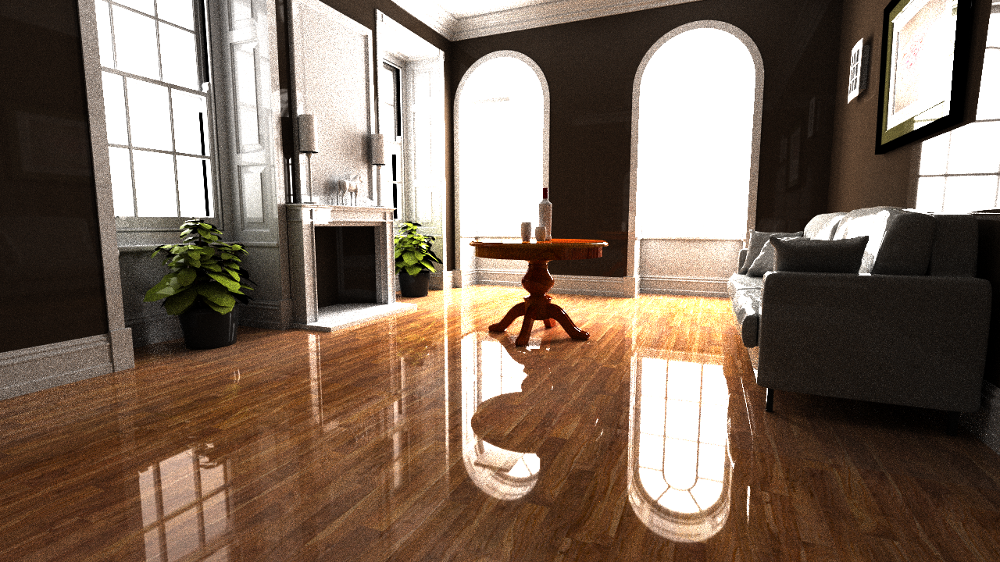
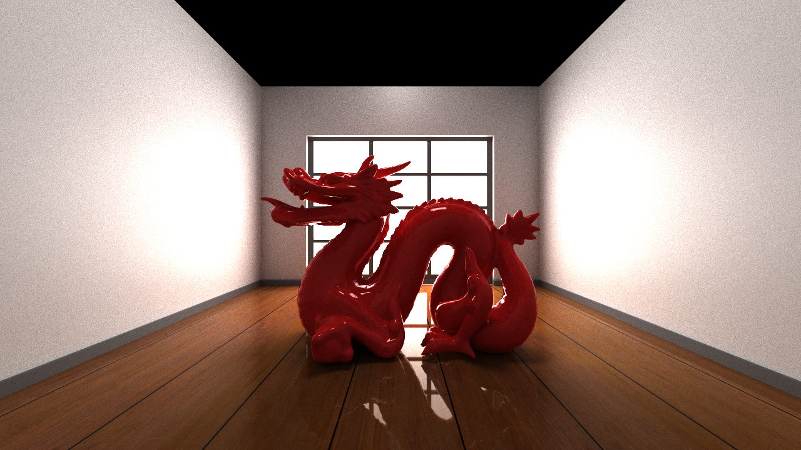

# RenderBoy

Originally, I began this project following the *University of Pennsylvania, CIS 565: GPU Programming and Architecture, Project 3*. However, I quickly went down the very common rabbit hole of trying to build a state-of-the-art physically based rendering software.

Although very powerful and beautiful, so far this renderer falls slightly short of industry renderers like Pixar's RenderMan. Which is why I decided to call it **RenderBoy**. The hope is that RenderBoy will soon grow to be more like RenderMan. 

> *Jokes aside...*

---

## Renders

### Fireplace Scene

*2200 samples, ray depth = 4*

### Stanford Dragon Scene

*2200 samples, ray depth = 4*

### BVH Visualization

*Bounding Volume Hierarchy visualization of the Stanford scene*

---

## Technical Implementation

The project is implemented in **C++/OpenGL/CUDA**:
- The bulk of computation runs on the CUDA side
- VBOs are transferred to the CPU side for real-time visualization

### Features So Far
- **OBJ loading** with diffuse/specular texture sampling
- **Bounding Volume Hierarchy** (using Surface Area Heuristic)
- **BRDF**

### Performance Improvements
- Stream compaction
- First-hit caching
- Material-based sorting

---

## Future Work

- [ ] Add more material types (glossy, dielectric, etc.)
- [ ] Implement global illumination
- [ ] Support for more scene formats
- [ ] Further optimization and denoising

---

### build instructions
* requires CMAKE and CUDA toolkit < 12.9

1. Create a build directory: mkdir build
2. Navigate into that directory: cd build
3. Open the CMake GUI to configure the project: `cmake-gui ..` 
4. Click Configure.
Select your Visual Studio version, and x64 for your platform. 
5. Click Generate.
6. If generation was successful, there should now be a Visual Studio solution (.sln) file in the build directory that you just created. Open this with Visual Studio.
7. Build and run.

---

## Acknowledgments

- University of Pennsylvania, CIS 5650: GPU Programming and Architecture
- Physically Based Rendering: From Theory to Implementation 4th Edition

---

*Built with ❤️ and CUDA*